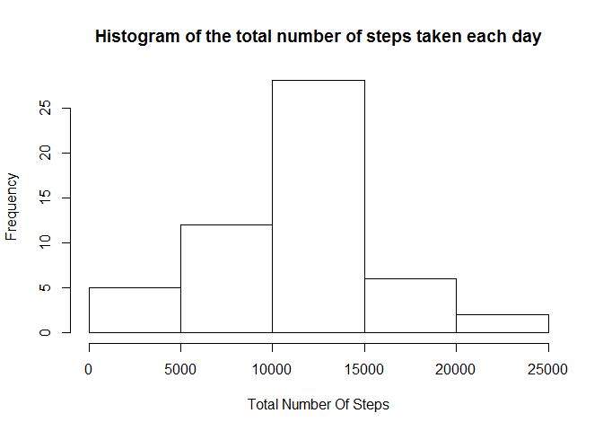
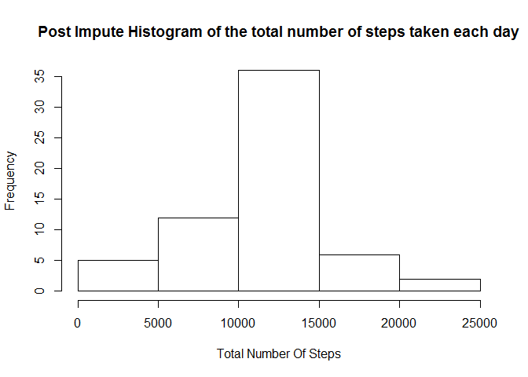
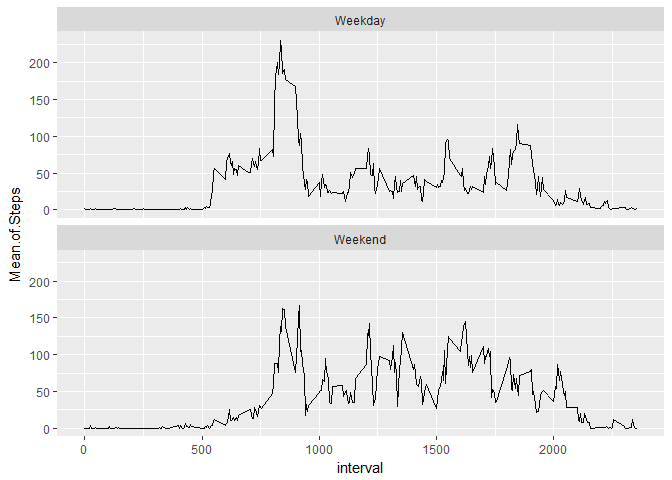

# Reproducible Research: Peer Assessment 1


## Loading and preprocessing the data

```r
library(knitr)
```

```
## Warning: package 'knitr' was built under R version 3.3.3
```

```r
library(plyr)
library(ggplot2)
opts_chunk$set(echo = TRUE)
#We assume the activity.csv is in current folder
activity <- read.csv("activity.csv")
#NA can be present in any of the columns 
cleanActivity <- na.omit(activity)
```

Let's look at original activity and cleanActivity


```r
head(activity)
```

```
##   steps       date interval
## 1    NA 2012-10-01        0
## 2    NA 2012-10-01        5
## 3    NA 2012-10-01       10
## 4    NA 2012-10-01       15
## 5    NA 2012-10-01       20
## 6    NA 2012-10-01       25
```

```r
head(cleanActivity)
```

```
##     steps       date interval
## 289     0 2012-10-02        0
## 290     0 2012-10-02        5
## 291     0 2012-10-02       10
## 292     0 2012-10-02       15
## 293     0 2012-10-02       20
## 294     0 2012-10-02       25
```
## What is mean total number of steps taken per day?
1. Calculate the total number of steps taken per day

```r
#Just to see how the spread is, let's calculate sum , median, mean
summaryActivity <- ddply(cleanActivity, .(date), function(x)c(sum(x[,1]), median(x[,1]), mean(x[,1])))
colnames(summaryActivity)[2:4] <- c("sum", "median", "mean")
```
2. Make a histogram of the total number of steps taken each day

```r
hist(summaryActivity$sum, main = "Histogram of the total number of steps taken each day", xlab = "Total Number Of Steps")
```

<!-- -->
3.Calculate and report the mean and median of the total number of steps taken per day

```r
#mean and median of 'total number of steps'
meanOfSteps <- mean(summaryActivity$sum)
medianOfSteps <- median(summaryActivity$sum)
```
Mean is 1.0766189\times 10^{4}. And Mediann is 1.0765\times 10^{4}

## What is the average daily activity pattern?
Make a time series plot (i.e. type = "l") of the 5-minute interval (x-axis) and the average number of steps taken, averaged across all days (y-axis)


```r
stepsPerDay <- ddply(cleanActivity, .(interval), function(x){mean(x[,1])})
colnames(stepsPerDay)[2]<-"Average.Steps"
plot(stepsPerDay$interval, stepsPerDay$Average.Steps, type="l", xlab = "Interval", ylab = "Average Steps")
```

<!-- -->

###Which 5-minute interval, on average across all the days in the dataset, contains the maximum number of steps?


```r
max_no_steps <- max(stepsPerDay$Average.Steps)
max_steps_interval <- stepsPerDay[stepsPerDay$Average.Steps == max_no_steps,][[1]]
```

Max no steps interval is 835.


## Imputing missing values

Note that there are a number of days/intervals where there are missing values (coded as NA). The presence of missing days may introduce bias into some calculations or summaries of the data.

###Calculate and report the total number of missing values in the dataset (i.e. the total number of rows with NAs)


```r
missing_value_count <- nrow(activity) - nrow(cleanActivity)
```
Total no of missing values are 2304.


#Devise a strategy for filling in all of the missing values in the dataset. 

For imputing we will use a function object. And this function object shall have imputing code for every NA value. This function object we shall initialize/ create instance and pass it to sapply. 

This shall give us a vector with imputed values of average no of steps during that interval for the particular date. This shall effectively make use apply commands and need of iterating 'code' wise is no longer there.


```r
imputeFunction <- function(stepsPerDay, activity){
        refActivity <- activity
        refStepsPerDay <- stepsPerDay
        
        getImputeValue<-function(interval){
                refStepsPerDay[refStepsPerDay$interval == interval, ][[2]]
        }
        getValue <- function(index){
                refActivity[index,1]
        }
        
        impute<-function(index){
                
                returnValue = imputeValue$getValue(index)
                
                if(is.na(returnValue)){
                        imputeValue$getImputeValue(refActivity[index, 3])
                }
                else {returnValue}
        }
        
        list( getImputeValue = getImputeValue, getValue=getValue , impute = impute)
}
# We could have passed the environment though, but learning from R course - cacheMatrix and rankAll! exercise looks clean
imputeValue <- imputeFunction(stepsPerDay = stepsPerDay, activity = activity)
```

#Create a new dataset that is equal to the original dataset but with the missing data filled in.


```r
newSteps <- sapply(rownames(activity) , imputeValue$impute)
newActivity <- cbind(activity, newSteps)

summaryImputedActivity <- ddply(newActivity, .(date), function(x)c(sum(x[,4]), median(x[,4]), mean(x[,4])))
#just to get a feel of how data gets distributed , sd calculation could have helped though
colnames(summaryImputedActivity)[2:4] <- c("sum", "median", "mean")
```


```r
hist(summaryImputedActivity$sum, main = "Post Impute Histogram of the total number of steps taken each day", xlab = "Total Number Of Steps")
```

<!-- -->


```r
# it is mean and median of total (sum) of activities !
meanOfImputedSteps <- mean(summaryImputedActivity$sum)
medianOfImputedSteps <- median(summaryImputedActivity$sum)
```

New mean is 1.0766189\times 10^{4} . There is no change!

New median is 1.0766189\times 10^{4}. Earlier one is 1.0765\times 10^{4}. There is a change.


## Are there differences in activity patterns between weekdays and weekends?

###Create a new factor variable in the dataset with two levels - "weekday" and "weekend" 


```r
newActivity['DayOfWeek']<- weekdays(as.Date(newActivity$date))
newActivity['TypeOfDay'] <- "TypeOfDay"
newActivity$TypeOfDay[newActivity$DayOfWeek %in% c('Saturday', 'Sunday')]<- "Weekend"
newActivity$TypeOfDay[newActivity$TypeOfDay != "Weekend"]<- "Weekday"
newActivity$TypeOfDay <- as.factor(newActivity$TypeOfDay)
newActivity<- newActivity[, c("date", "interval", "newSteps","TypeOfDay", "DayOfWeek")]
```

###Make a panel plot containing a time series plot .
(i.e. type = "l") of the 5-minute interval (x-axis) and the average number of steps taken, averaged across all weekday days or weekend days (y-axis)


```r
perDayWithWeekendEffect<-ddply(newActivity, .( interval, TypeOfDay), summarize, Mean.of.Steps=mean(newSteps))
g<- ggplot(perDayWithWeekendEffect, aes(x=interval, y=Mean.of.Steps))+geom_line()+facet_wrap(~TypeOfDay, ncol = 1)
print(g)
```

<!-- -->
